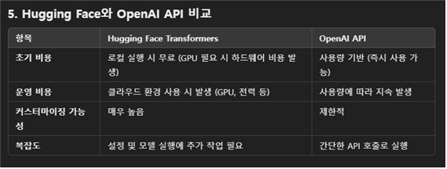

# OpenAI API 비용 문제 💸

## 문제 정의
    OpenAI API 사용하여 DB 데이터 분석, 자연어 질의 처리 과정에서 과도한 비용이 발생함.
    무료로 상용화하기에 부적합함.
 

## HuggingFace와 OpenAPI 비교

 

## 해결 방안
    Hugging Face Transformers 오픈소스 라이브러리를 사용한다.
    
    자연어 처리(NLP) 및 기타 AI 작업을 위한 강력한 오픈소스 라이브러리이다.

    OpenAI API 호출 비용이 사라진다.

    사전 학습된 모델을 제공하며, 다양한 NLP 작업(번역, 텍스트 요약, 질문 응답 등)에 사용할 수 있음

## Hugging Face의 장단점
+ 장점
    -   다양한 사전 학습 모델과 데이터셋 제공.
    -   쉬운 설치와 사용 (Pipeline 인터페이스).
    -   PyTorch, TensorFlow 등 다양한 백엔드 지원.
    -   Fine-tuning으로 작업 최적화 가능.
    -   무료 사용 :
            Hugging Face Transformers 라이브러리와 사전 학습된 모델은 무료로 제공되며, 로컬 시스템에서 실행할 수 있습니다.
            인터넷 연결 없이도 사용할 수 있어 비용 절감 가능.
    -   다양한 모델 지원:
            GPT-2, T5, BERT 등 고성능 사전 학습 모델을 바로 활용 가능.
            자연어 질의(SQL 쿼리 생성 등)나 데이터 요약과 같은 작업 수행 가능.
    -   확장성:
            도메인 데이터(예: 에너지 관리 시스템 데이터)로 추가 학습(파인튜닝)을 통해 정확도를 높일 수 있음.
            
+   단점
    -   대규모 모델(GPT-3, BLOOM 등)은 고성능 하드웨어(GPU/TPU)가 필요.
    -   대형 모델 실행 시 메모리 사용량이 높아질 수 있음.

## Hugging Face의 주요 기능
    (1) 사전 학습된 모델 제공

        Hugging Face Model Hub에서 다양한 사전 학습 모델을 무료로 다운로드 가능.
        예: BERT, GPT-2, T5, DistilBERT, BLOOM, LLaMA 등.

    (2) 다양한 NLP 작업 지원

        텍스트 생성 (text-generation): GPT-2, GPT-3 같은 모델 사용.
        텍스트 분류 (text-classification): 감정 분석, 뉴스 카테고리 분류.
        질문 응답 (question-answering): 질문에 대한 답변을 텍스트에서 추출.
        번역 (translation): 텍스트를 다른 언어로 번역.
        요약 (summarization): 긴 텍스트를 요약.

    (3) Fine-tuning 및 Customization

        특정 데이터셋에 맞게 사전 학습된 모델을 Fine-tuning 가능.
        Fine-tuning된 모델로 성능 향상 및 작업 특화 가능.

    (4) 멀티 프레임워크 지원

        PyTorch, TensorFlow, JAX 모두에서 동작.
        동일 코드로 여러 백엔드에서 실행 가능.