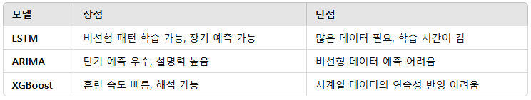

# 🚀 태양광 발전량 예측을 위한 최적의 접근 방법
태양광 발전량을 예측하려면 기상 데이터(Weatherbit API)와 발전소 운영 데이터(발전 실적 데이터)를 결합해야 해.
💡 목표: Weatherbit API를 활용하여 기상 데이터를 수집하고, LSTM 모델을 활용해 발전량을 예측하는 것.

## 1️⃣ 태양광 발전량 예측을 위한 주요 데이터
✅ Weatherbit API에서 가져올 기상 데이터 (16일까지 예보 가능)
+   temp (기온)
+   rh (습도)
+   clouds (구름량)
+   pres (기압)
+   wind_spd (풍속)
+   precip (강수량)
+   snow (눈)
+   uv (자외선 지수)
+   sunrise_ts, sunset_ts (일출/일몰 시간) → 일조 시간 계산 가능

✅ 발전소 운영 데이터 (필수)
+   발전소 ID
+   설비 용량(kWp)
+   과거 발전량 데이터(kWh)
+   패널 기울기, 방향 (가능하면 포함)
### 📌 기상 데이터(Weatherbit) + 발전 실적 데이터를 결합하면 더 정확한 예측 가능!

## 2️⃣ 모델 선택: LSTM vs 다른 모델

### 📌 ✅ 결론:
+   LSTM이 태양광 발전량 예측에 가장 적합하지만, 데이터가 적다면 XGBoost + ARIMA 조합도 고려할 수 있음.

## 3️⃣ 단계별 접근 방법
### 📌 Step 1: 데이터 수집 및 정리
+   ✅ Weatherbit API 활용 → 16일 기상 예보 데이터 수집
+   ✅ 발전소 운영 데이터 확보 → 과거 발전량(kWh), 설비 용량(kWp) 데이터 필요
+   ✅ 데이터 결합 → 같은 날짜 기준으로 기상 데이터 + 발전량 매칭

### 📌 Step 2: 데이터 전처리
+   ✅ 결측값 처리 → 비어 있는 날씨 데이터 보정
+   ✅ 스케일링 → 기온, 풍속, 습도 등 정규화 (Min-Max Scaling)
+   ✅ 시간 특성 추가 → 일출-일몰 시간 차이 계산하여 일조 시간 변수 추가

### 📌 Step 3: 모델 학습 및 평가
✅ LSTM 모델 구축
+   입력 데이터: 기온, 습도, 구름량, 풍속, 강수량, 일조시간
+   타겟 데이터: 발전량(kWh)
+   데이터 형식: LSTM 입력 데이터 = (날짜별 시계열)

✅ 모델 성능 평가
+   MAE(Mean Absolute Error), RMSE(Root Mean Square Error) 활용
+   LSTM vs XGBoost vs ARIMA 비교

✅ 최적화 작업
+   하이퍼파라미터 튜닝 (LSTM 노드 개수, 학습률 조정)
+   데이터 더 많이 확보할 경우, Transformer 모델도 고려 가능

## 4️⃣ 최종 목표
    🔹 Weatherbit API + 발전소 실적 데이터 → LSTM 학습
    🔹 16일 기상 예보를 활용하여 태양광 발전량 예측 가능
    🔹 모델 성능 검증 후 배포 (Streamlit, FastAPI 활용 가능)

### 📌 다음 단계:
+   발전소 실적 데이터를 확보할 수 있는지 확인
+   Weatherbit API 데이터를 저장하는 방법 결정 (DB or CSV)
+   먼저 간단한 XGBoost 모델로 시뮬레이션 후 LSTM 적용 가능

✅ 이 방향으로 진행하면 될 것 같은데, 어떻게 생각해? 추가로 궁금한 부분 있으면 말해줘! 😊