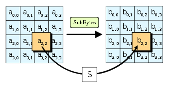
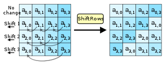
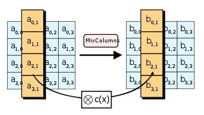
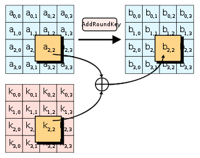

# AES-256

## AES-256이란?
    AES-256은 256비트 키를 사용하여 일반 텍스트를 암호로 변환합니다. 
    AES-256은 가장 큰 비트의 키 크기를 지원하고 무차별 암호 대입 공격에 거의 뚫리지 않아 널리 사용되는 암호화 기술입니다. 
    민감한 정보, 통제된 비분류 정보(Controlled Unclassified Information, CUI), 기밀 정보를 보호합니다. AES-256 알고리즘은 암호화 키 없이 복호화하기가 불가능할 정도로 매우 어렵습니다.

## AES design

출처: Techtarget

## AES 알고리즘 장점
    1. 무차별 암호 대입 공격으로부터 강력
        
    올바른 키를 찾을 때까지 가능한 모든 키 조합을 시도하는 무차별 암호 대입 공격에 효율적으로 대응할 수 있습니다. 키 크기가 128비트인 경우, 가능한 키의 수는 2128또는 3.4 x 1038개이므로 무차별 대입으로 암호화를 해독하는 것은 사실상 불가능합니다.

    2. 효율성

    AES 알고리즘은 적은 처리 능력으로도 빠르게 데이터를 암호화하고 복호화할 수 있습니다. 그렇기에 온라인 거래 및 보안 통신과 같이 실시간 암호화 및 복호화가 필요한 애플리케이션에 적합합니다.
    AES 알고리즘은 대부분의 최신 운영 체제 및 플랫폼에서 지원하고 있어 온라인 뱅킹, 전자상거래, 메신저 등 다양한 애플리케이션에서 기밀 데이터를 보호하는 데 널리 사용됩니다.
    결론적으로, AES 알고리즘은 안전하고 효율적이며 신뢰성이 높아 민감한 정보를 보호하는데 매우 효과적입니다. 무차별 암호 대입 공격에 대한 저항력이 강점이며, 효율성이 뛰어나 실시간 암호화 및 복호화가 필요한 애플리케이션에 사용하기에 적합합니다.

출처: Geeksforgeeks

## AES 알고리즘 작동 방식
    AES 알고리즘은 128비트의 고정 블록 크기를 사용하며 128, 192, 256비트의 키 크기를 지원합니다. 키 크기에 따라 암호화 강도가 결정되며, 키 크기가 클수록 보안이 강화됩니다. AES 알고리즘은 암호화할 데이터를 128비트 블록으로 나눈 다음 일련의 수학적 연산을 사용하여 각 블록을 암호 블록으로 변환하는 방식으로 작동합니다.

    AES 알고리즘은 다음의 네 가지 주요 작업으로 구성됩니다:

    1. SubBytes
    2. ShiftRows
    3. MixColumns
    4. AddRoundKey

    이 작업은 키 크기에 따라 여러 번 반복되어 여러 라운드의 암호화를 생성합니다. 라운드 수는 128비트 키는 10라운드, 192비트 키는 12라운드, 256비트 키는 14라운드로 키 크기에 따라 달라집니다.

    1. SubBytes
    이 연산에서는 입력 블록의 각 바이트가 S-박스라고 하는 고정 치환 테이블에서 해당 바이트에 해당하는 바이트로 대체됩니다.
    S-박스에는 가능한 모든 8비트 값의 무작위로 생성된 순열이 포함되어 있어 암호화된 데이터에서 원본 데이터를 파악하기 어렵습니다.

    2. ShiftRows
    이 연산에서는 입력 블록의 각 행에 있는 바이트가 왼쪽으로 특정 위치만큼 이동합니다. 첫번째 행은 이동되지 않습니다. 두번째 행은 한 위치 왼쪽으로 이동하고, 세번째 행은 두 위치 왼쪽으로 이동하며, 네번째 행은 세 위치 왼쪽으로 이동합니다.    
    이 작업을 통해 데이터가 블록 전체에 분산되고 인접한 바이트 간의 상관관계가 감소하여 암호화된 데이터에서 원본 데이터를 식별하기가 더 어려워집니다.

    3. MixColumns
    이 연산에서는 입력 블록의 각 열에 고정 행렬을 곱하여 새 열을 생성합니다.
    이 작업을 수행하면 출력 블록의 각 바이트가 입력 블록의 여러 바이트의 영향을 받게 되므로 암호화된 데이터에서 원본 데이터를 식별하는 것을 이전 단계보다 더 복잡하고 어렵게 변환합니다.

    4. AddRoundKey
    이 연산에서는 입력 블록의 각 바이트가 원래 키에서 생성된 키 스케줄의 해당 바이트와 XOR(배타적 논리합) 처리됩니다.
    이 연산은 각 출력 블록 바이트가 키의 해당 바이트에 따라 달라지도록 하여 올바른 키가 없으면 데이터를 복호화할 수 없도록 합니다. 
    첫 번째 암호화 라운드 이후에는 키 크기에 따라 이 네 가지 작업을 여러 번 반복하여 여러 라운드의 암호화를 생성합니다. 
    각 라운드는 원래 키에서 생성된 키 스케줄과 다른 키를 사용합니다. 
    마지막 라운드에는 MixColumns 연산이 포함되지 않아 해독을 간단화 합니다.
